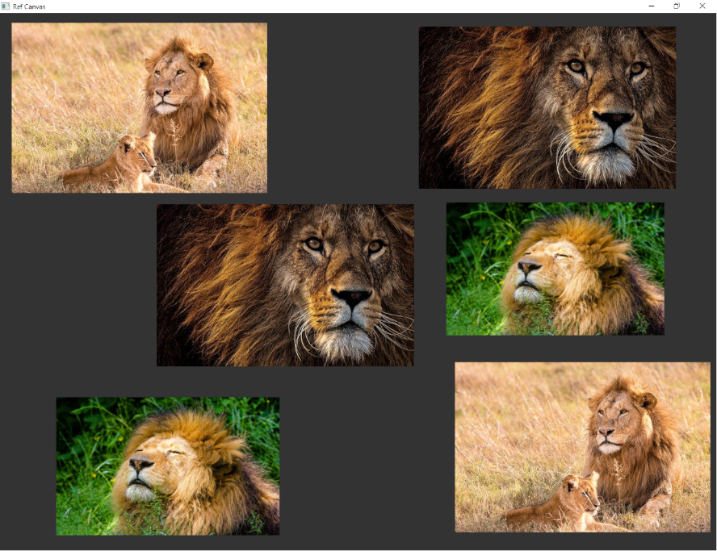

# RefCanvas
---


This is a tool that allows artists to stack a bunch of images on a window for reference purposes. It's still in development.

**NOTE : **
 *This tool is still being developed*


# How to build
---

If testing on linux you need to install [Glfw3](https://www.glfw.org/) and [Glew](http://glew.sourceforge.net/) libraries.

To test out the application :
Clone it :
```bash
git clone https://github.com/JNjenga/RefCanvas.git # Clone it
```
Use premake to generate project files for your enviroment:
```bash
premake5 vs2017
```
or 
```bash
premake5 gmake2
```
The project file will be created in `workspace` directory.

If on windows build using visual studio, if on linux use make. 

# Usage
Drag and drop images on to the window.

## Keys

- `MIDDLE_MOUSE_BTN` & move mouse  - Panning around the world
- `LEFT_MOUSE_BTN` - Select image
- `X` - Remove image
- `G` & move mouse - Move selected image
- `J` - Scale up selected image
- `K` - Scale down selected image


# Built with
- C++
- Opengl
- [GLFW 3](https://www.glfw.org/)
- [STB image](https://github.com/nothings/stb/blob/master/stb_image.h)
- [GLM](https://glm.g-truc.net/0.9.9/index.html)

# Contact
James Njenga - see [https://jnjenga.com/about#contacts](https://jnjenga.com/about#contacts)

# License
Distributed under the MIT License. See `LICENSE` for more information.